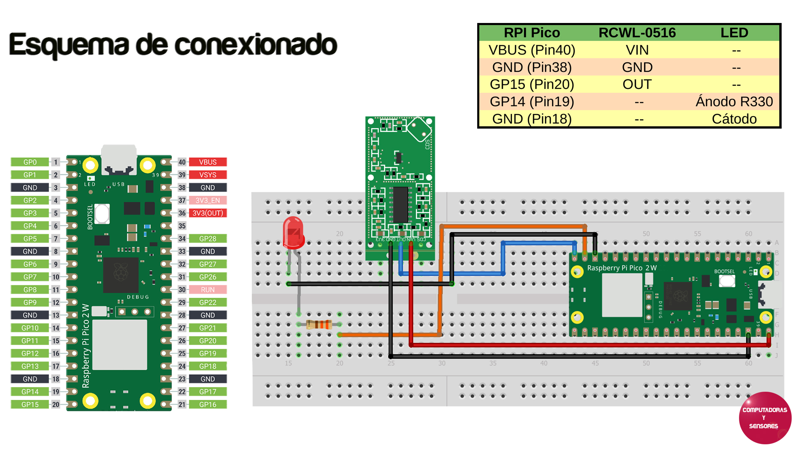

# Detector de presencia con Raspberry Pi Pico y sensor RCWL-0516

Código en MicroPython para detectar movimiento, si bien se utiliza la Raspberry Pi Pico 2W con el RP2350 puede usarse cualquiera de los modelos de Raspberry Pi Pico con el RP2040 también.

# Paso a paso

La explicación completa la podrás ver en el siguiente video de Youtube:

